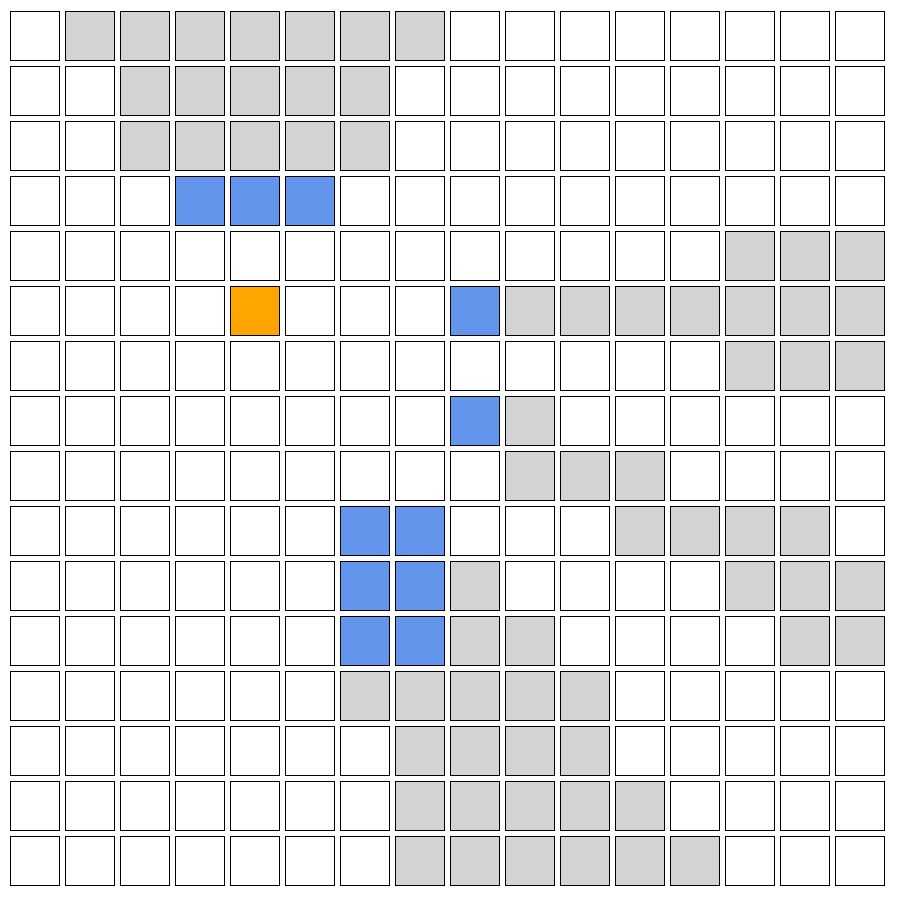

# line_of_sight

A crate for finding the line of sight on a 2D grid.

## Example

    // create a 16x17 line of sight map with empty cells by default
    let mut map = ShadowMap::new_with_empty_cells(16, 17);

    // add some obstacles
    let obstacles = vec![
        (3, 3),
        (4, 3),
        (5, 3),
        (8, 7),
        (8, 5),
        (6, 9),
        (6, 10),
        (6, 11),
        (7, 11),
        (7, 10),
        (7, 9),
    ];

    for obstacle in obstacles {
        map.set(obstacle.0, obstacle.1, BLOCK);
    }

    // set the center to be (4, 5)
    let center = (4.0, 5.0);
    
    // fully scan the map (in 4 directions. Use `scan_arc` to only scan in 1 direction)
    map.full_scan(center);

    // set (4, 5) to be the "player cell" for visual purposes
    map.set(4, 5, PLAYER);
    map.show();
    
### Result
[2, 0, 0, 0, 0, 0, 0, 0, 2, 2, 2, 2, 2, 2, 2, 2]
[2, 2, 0, 0, 0, 0, 0, 2, 2, 2, 2, 2, 2, 2, 2, 2]
[2, 2, 0, 0, 0, 0, 0, 2, 2, 2, 2, 2, 2, 2, 2, 2]
[2, 2, 2, 1, 1, 1, 2, 2, 2, 2, 2, 2, 2, 2, 2, 2]
[2, 2, 2, 2, 2, 2, 2, 2, 2, 2, 2, 2, 2, 0, 0, 0]
[2, 2, 2, 2, 3, 2, 2, 2, 1, 0, 0, 0, 0, 0, 0, 0]
[2, 2, 2, 2, 2, 2, 2, 2, 2, 2, 2, 2, 2, 0, 0, 0]
[2, 2, 2, 2, 2, 2, 2, 2, 1, 0, 2, 2, 2, 2, 2, 2]
[2, 2, 2, 2, 2, 2, 2, 2, 2, 0, 0, 0, 2, 2, 2, 2]
[2, 2, 2, 2, 2, 2, 1, 1, 2, 2, 2, 0, 0, 0, 0, 2]
[2, 2, 2, 2, 2, 2, 1, 1, 0, 2, 2, 2, 2, 0, 0, 0]
[2, 2, 2, 2, 2, 2, 1, 1, 0, 0, 2, 2, 2, 2, 0, 0]
[2, 2, 2, 2, 2, 2, 0, 0, 0, 0, 0, 2, 2, 2, 2, 2]
[2, 2, 2, 2, 2, 2, 2, 0, 0, 0, 0, 2, 2, 2, 2, 2]
[2, 2, 2, 2, 2, 2, 2, 0, 0, 0, 0, 0, 2, 2, 2, 2]
[2, 2, 2, 2, 2, 2, 2, 0, 0, 0, 0, 0, 0, 2, 2, 2]
[2, 2, 2, 2, 2, 2, 2, 0, 0, 0, 0, 0, 0, 0, 2, 2]

#### Explanation
* 0 -- unreachable cells
* 1 - obstacles
* 2 - reachable cells
* 3 - center (optional; visual purpose only)

### Graphical result

#### Explanation
* white cells - reachable cells
* grey cells - unreachable cells
* blue cells - obstacles
* orange cell - center
